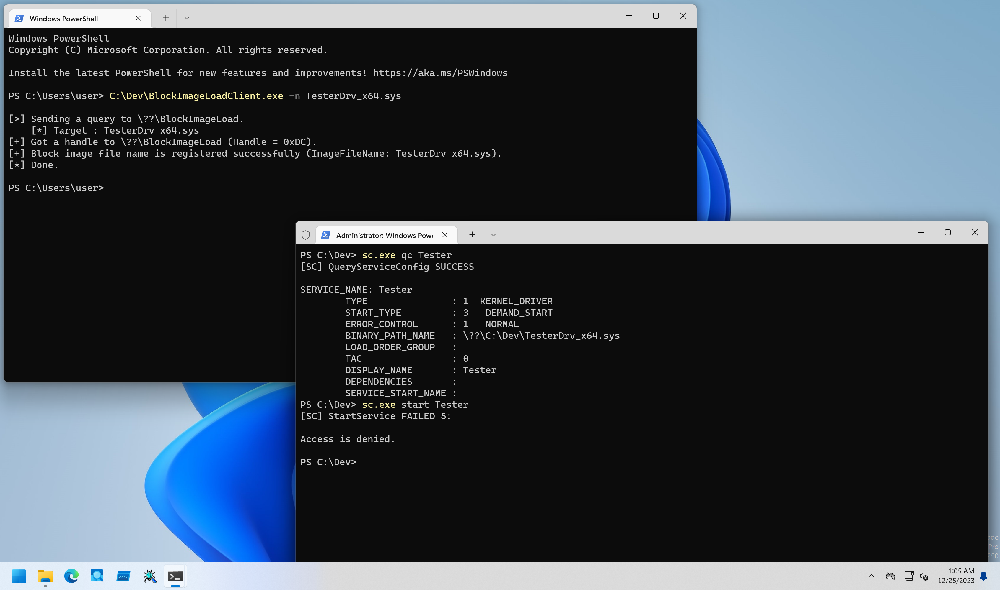

# BlockImageLoad

PoCs to block driver loading with Load Image Notify Callback method.

## Installation

```
PS C:\> sc.exe create BlockImageLoad type= kernel binpath= C:\Dev\BlockImageLoadDrv_x64.sys
PS C:\> sc.exe start BlockImageLoad
```

## Client Program Usage

Client program registers image file name to block.

```
PS C:\Dev> .\BlockImageLoadClient.exe -h

BlockImageLoadClient - Client for BlockImageLoadDrv.

Usage: BlockImageLoadClient.exe [Options]

        -h, --help       : Displays this help message.
        -u, --unregister : Flag to unregister callback.
        -n, --name       : Specifies a image file name to block.
```

To test driver blocking, specify the target driver's image file name including extension with `-n` option as follows.
You can use [TesterDrv](./TesterDrv/) for quick testing:

```
PS C:\Dev> sc.exe create Tester type= kernel binpath= C:\Dev\TesterDrv_x64.sys
[SC] CreateService SUCCESS
PS C:\Dev> sc.exe qc Tester
[SC] QueryServiceConfig SUCCESS

SERVICE_NAME: Tester
        TYPE               : 1  KERNEL_DRIVER
        START_TYPE         : 3   DEMAND_START
        ERROR_CONTROL      : 1   NORMAL
        BINARY_PATH_NAME   : \??\C:\Dev\TesterDrv_x64.sys
        LOAD_ORDER_GROUP   :
        TAG                : 0
        DISPLAY_NAME       : Tester
        DEPENDENCIES       :
        SERVICE_START_NAME :
PS C:\Dev> sc.exe start Tester

SERVICE_NAME: Tester
        TYPE               : 1  KERNEL_DRIVER
        STATE              : 4  RUNNING
                                (STOPPABLE, NOT_PAUSABLE, IGNORES_SHUTDOWN)
        WIN32_EXIT_CODE    : 0  (0x0)
        SERVICE_EXIT_CODE  : 0  (0x0)
        CHECKPOINT         : 0x0
        WAIT_HINT          : 0x0
        PID                : 0
        FLAGS              :
PS C:\Dev> sc.exe stop Tester

SERVICE_NAME: Tester
        TYPE               : 1  KERNEL_DRIVER
        STATE              : 1  STOPPED
        WIN32_EXIT_CODE    : 0  (0x0)
        SERVICE_EXIT_CODE  : 0  (0x0)
        CHECKPOINT         : 0x0
        WAIT_HINT          : 0x0
PS C:\Dev> C:\Dev\BlockImageLoadClient.exe -n TesterDrv_x64.sys

[>] Sending a query to \??\BlockImageLoad.
    [*] Target : TesterDrv_x64.sys
[+] Got a handle to \??\BlockImageLoad (Handle = 0x2C4).
[+] Block image file name is registered successfully (ImageFileName: TesterDrv_x64.sys).
[*] Done.

PS C:\Dev> sc.exe start Tester
[SC] StartService FAILED 5:

Access is denied.
```

