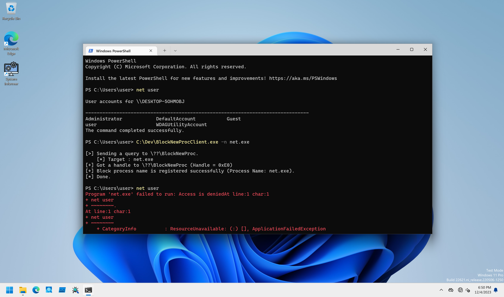

# BlockNewProc

PoCs to block new process with Process Notify Callback method.

## Installation

```
PS C:\> sc.exe create BlockNewProc type= kernel binpath= C:\Dev\BlockNewProcDrv_x64.sys
PS C:\> sc.exe start BlockNewProc
```

## Client Program Usage

Client program registers image file name to block.

```
PS C:\Dev> C:\Dev\BlockNewProcClient.exe -h

BlockNewProcClient - Client for BlockNewProcDrv.

Usage: BlockNewProcClient.exe [Options]

        -h, --help       : Displays this help message.
        -u, --unregister : Flag to unregister callback.
        -n, --name       : Specifies a image file name to block.
```

To test process blocking, specify the target process's image file name including extension with `-n` option as follows:

```
PS C:\Dev> net user

User accounts for \\DESKTOP-5OHMOBJ

-------------------------------------------------------------------------------
Administrator            DefaultAccount           Guest
user                     WDAGUtilityAccount
The command completed successfully.

PS C:\Dev> .\BlockNewProcClient.exe -n net.exe

[>] Sending a query to \??\BlockNewProc.
    [*] Target : net.exe
[+] Got a handle to \??\BlockNewProc (Handle = 0xC8)
[+] Block process name is registered successfully (Process Name: net.exe).
[*] Done.

PS C:\Dev> net user
Program 'net.exe' failed to run: Access is deniedAt line:1 char:1
+ net user
+ ~~~~~~~~.
At line:1 char:1
+ net user
+ ~~~~~~~~
    + CategoryInfo          : ResourceUnavailable: (:) [], ApplicationFailedException
    + FullyQualifiedErrorId : NativeCommandFailed
```

You can unregister process blockng with `-u` flag or unload the kernel driver:

```
PS C:\Dev> net user
Program 'net.exe' failed to run: Access is deniedAt line:1 char:1
+ net user
+ ~~~~~~~~.
At line:1 char:1
+ net user
+ ~~~~~~~~
    + CategoryInfo          : ResourceUnavailable: (:) [], ApplicationFailedException
    + FullyQualifiedErrorId : NativeCommandFailed

PS C:\Dev> .\BlockNewProcClient.exe -u

[>] Sending a query to \??\BlockNewProc.
[+] Got a handle to \??\BlockNewProc (Handle = 0x2D0)
[+] Process Notify Callback is unregistered successfully.
[*] Done.

PS C:\Dev> net user

User accounts for \\DESKTOP-5OHMOBJ

-------------------------------------------------------------------------------
Administrator            DefaultAccount           Guest
user                     WDAGUtilityAccount
The command completed successfully.
```

