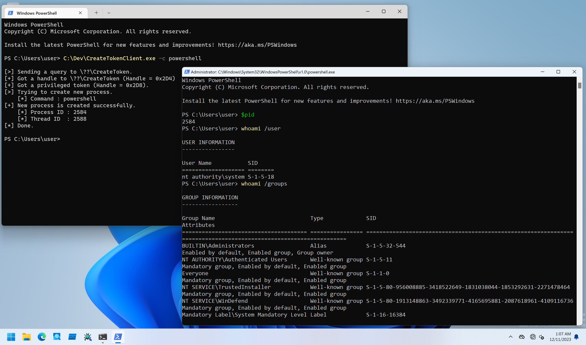

# CreateToken

PoCs to get full privileged SYSTEM token with `ZwCreateToken()` API.

## Installation

```
PS C:\> sc.exe create CreateToken type= kernel binpath= C:\Dev\CreateTokenDrv_x64.sys
PS C:\> sc.exe start CreateToken
```

## Client Program Usage

Client program performs `NT AUTHORITY\SYSTEM` process execution.

```
PS C:\Dev> .\CreateTokenClient.exe -h

CreateTokenClient - Client for CreateTokenDrv.

Usage: CreateTokenClient.exe [Options]

        -h, --help    : Displays this help message.
        -c, --command : Specifies command to execute. Default is "cmd.exe".
```

Command to execute can be specified with `-c` option.
If you do not specify any command, this PoC try to execute `cmd.exe` as a full privileged process:

```
PS C:\Dev> .\CreateTokenClient.exe

[>] Sending a query to \??\CreateToken.
[+] Got a handle to \??\CreateToken (Handle = 0x2D0)
[+] Got a privileged token (Handle = 0x2D4).
[>] Trying to create new process.
    [*] Command : cmd.exe
[+] New process is created successfully.
    [*] Process ID : 2936
    [*] Thread ID  : 7020
[*] Done.
```

