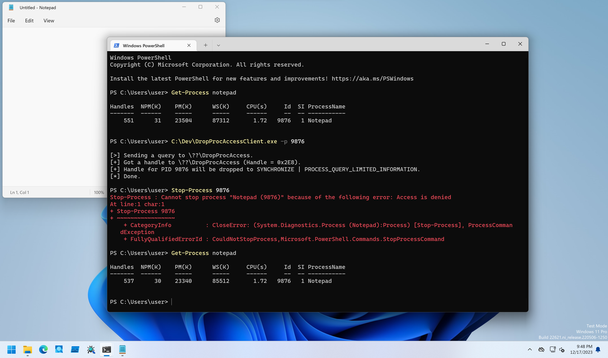

# DropProcAccess

PoCs to drop process handle access with Object Notify Callback.

## Installation

```
PS C:\> sc.exe create DropProcAccess type= kernel binpath= C:\Dev\DropProcAccessDrv_x64.sys
PS C:\> sc.exe start DropProcAccess
```

## Client Program Usage

Client program can set and remove Object Notify Callback for dropping process handle access.

```
PS C:\Dev> .\DropProcAccessClient.exe -h

DropProcAccessClient - Client for DropProcAccessDrv.

Usage: DropProcAccessClient.exe [Options]

        -h, --help   : Displays this help message.
        -r, --remove : Flag to Object Notify Callback to drop process handle access.
        -p, --pid    : Specifies a target PID to protect in decimal format.
```

To register Object Notify Callback for dropping process handle access, specify Target PID with `-p` option.
Then, kernel driver drops new process handle access to `SYNCHRONIZE | PROCESS_QUERY_LIMITED_INFORMATION` as Protected Process, so most of operations such as termination will be blocked as follows:

```
PS C:\Dev> Get-Process -Name notepad

Handles  NPM(K)    PM(K)      WS(K)     CPU(s)     Id  SI ProcessName
-------  ------    -----      -----     ------     --  -- -----------
    558      31    23324      86304       0.67   2432   1 Notepad


PS C:\Dev> .\DropProcAccessClient.exe -p 2432

[>] Sending a query to \??\DropProcAccess.
[+] Got a handle to \??\DropProcAccess (Handle = 0x2D0).
[+] Handle for PID 2432 will be dropped to SYNCHRONIZE | PROCESS_QUERY_LIMITED_INFORMATION.
[*] Done.

PS C:\Dev> Stop-Process -Id 2432
Stop-Process : Cannot stop process "Notepad (2432)" because of the following error: Access is denied
At line:1 char:1
+ Stop-Process -Id 2432
+ ~~~~~~~~~~~~~~~~~~~~~
    + CategoryInfo          : CloseError: (System.Diagnostics.Process (Notepad):Process) [Stop-Process], ProcessComman
   dException
    + FullyQualifiedErrorId : CouldNotStopProcess,Microsoft.PowerShell.Commands.StopProcessCommand

PS C:\Dev> Get-Process -Id 2432

Handles  NPM(K)    PM(K)      WS(K)     CPU(s)     Id  SI ProcessName
-------  ------    -----      -----     ------     --  -- -----------
    542      30    23212      84688       0.69   2432   1 Notepad
```

To remove Object Notify Callback for dropping process handle access, set `-r` flag as follows:

```
PS C:\Dev> Get-Process -Id 2432

Handles  NPM(K)    PM(K)      WS(K)     CPU(s)     Id  SI ProcessName
-------  ------    -----      -----     ------     --  -- -----------
    536      30    23116      84632       0.69   2432   1 Notepad


PS C:\Dev> Stop-Process -Id 2432
Stop-Process : Cannot stop process "Notepad (2432)" because of the following error: Access is denied
At line:1 char:1
+ Stop-Process -Id 2432
+ ~~~~~~~~~~~~~~~~~~~~~
    + CategoryInfo          : CloseError: (System.Diagnostics.Process (Notepad):Process) [Stop-Process], ProcessComman
   dException
    + FullyQualifiedErrorId : CouldNotStopProcess,Microsoft.PowerShell.Commands.StopProcessCommand

PS C:\Dev> .\DropProcAccessClient.exe -r

[>] Sending a query to \??\DropProcAccess.
[+] Got a handle to \??\DropProcAccess (Handle = 0x2D0).
[+] Object Notify Callback is removed successfully.
[*] Done.

PS C:\Dev> Stop-Process -Id 2432
PS C:\Dev> Get-Process -Id 2432
Get-Process : Cannot find a process with the process identifier 2432.
At line:1 char:1
+ Get-Process -Id 2432
+ ~~~~~~~~~~~~~~~~~~~~
    + CategoryInfo          : ObjectNotFound: (2432:Int32) [Get-Process], ProcessCommandException
    + FullyQualifiedErrorId : NoProcessFoundForGivenId,Microsoft.PowerShell.Commands.GetProcessCommand
```

