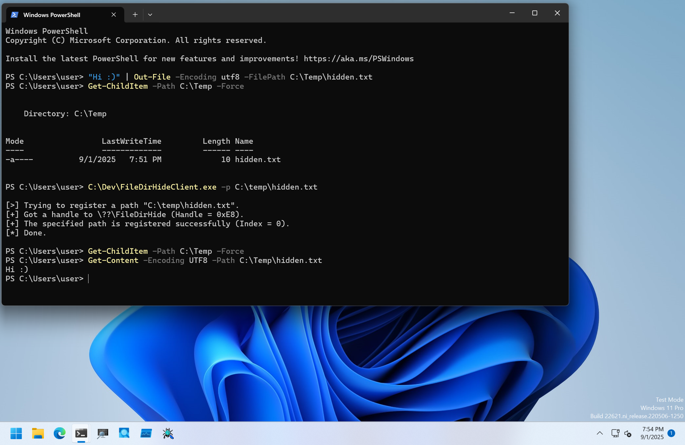

# FileDirHide

PoCs to hide file/directory.

## Installation
```
PS C:\> sc.exe create FileDirHide type= filesys binpath= C:\Dev\FileDirHideDrv_x64.sys
PS C:\> sc.exe start FileDirHide
```

## Client Program Usage

Client program manages file/directory entries to hide.

```
PS C:\Dev> .\FileDirHideClient.exe -h

FileDirHideClient - Client for FileDirHideDrv.

Usage: FileDirHideClient.exe [Options]

        -h, --help   : Displays this help message.
        -p, --path   : Specifies file/directory path to hide.
        -r, --remove : Specifies index of file/directory path to remove from hiding entries.
        -f, --flush  : Flag to remove all hiding entries.
        -l, --list   : Flag to list all hiding entries.
```

To add a new file/directory entry to hide, use `-p` option as follows:

```
PS C:\Dev> Get-ChildItem -Path C:\ -Force | ?{ $_.Name -ieq 'temp' }


    Directory: C:\


Mode                 LastWriteTime         Length Name
----                 -------------         ------ ----
d-----         6/24/2025  12:27 AM                Temp

PS C:\Dev> .\FileDirHideClient.exe -p C:\Temp

[>] Trying to register a path "C:\Temp".
[+] Got a handle to \??\FileDirHide (Handle = 0x2D0).
[+] The specified path is registered successfully (Index = 0).
[*] Done.
PS C:\Dev> Get-ChildItem -Path C:\ -Force | ?{ $_.Name -ieq 'temp' }
PS C:\Dev>
```

Registered entries can be listed with `-l` option:

```
PS C:\Dev> .\FileDirHideClient.exe -l

[>] Trying to list all entries.
[+] Got a handle to \??\FileDirHide (Handle = 0x2D0).
[+] All entries are removed successfully.
[*] Got 3 entries.

Index Registered Path
===== ===============
    0 C:\Temp
    1 C:\Temp\hidden.txt
    2 C:\secret.txt

[*] Done.
```

Entries can be removed by specifying entry ID with `-r` option:

```
PS C:\Dev> .\FileDirHideClient.exe -l

[>] Trying to list all entries.
[+] Got a handle to \??\FileDirHide (Handle = 0x230).
[+] All entries are removed successfully.
[*] Got 3 entries.

Index Registered Path
===== ===============
    0 C:\Temp
    1 C:\Temp\hidden.txt
    2 C:\secret.txt

[*] Done.

PS C:\Dev> .\FileDirHideClient.exe -r 1

[>] Trying to remove an entry (Index: 1).
[+] Got a handle to \??\FileDirHide (Handle = 0x2D0).
[+] The specified entry is removed successfully.
[*] Done.

PS C:\Dev> .\FileDirHideClient.exe -l

[>] Trying to list all entries.
[+] Got a handle to \??\FileDirHide (Handle = 0x2D4).
[+] All entries are removed successfully.
[*] Got 2 entries.

Index Registered Path
===== ===============
    0 C:\Temp
    2 C:\secret.txt

[*] Done.
```

To remove all entries at a time, use `-f` option:

```
PS C:\Dev> .\FileDirHideClient.exe -l

[>] Trying to list all entries.
[+] Got a handle to \??\FileDirHide (Handle = 0x2D4).
[+] All entries are removed successfully.
[*] Got 2 entries.

Index Registered Path
===== ===============
    0 C:\Temp
    2 C:\secret.txt

[*] Done.

PS C:\Dev> .\FileDirHideClient.exe -f

[>] Trying to remove all entries.
[+] Got a handle to \??\FileDirHide (Handle = 0x2D0).
[+] All entries are removed successfully.
[*] Done.

PS C:\Dev> .\FileDirHideClient.exe -l

[>] Trying to list all entries.
[+] Got a handle to \??\FileDirHide (Handle = 0x2D0).
[+] All entries are removed successfully.
[*] No entries.
[*] Done.
```

