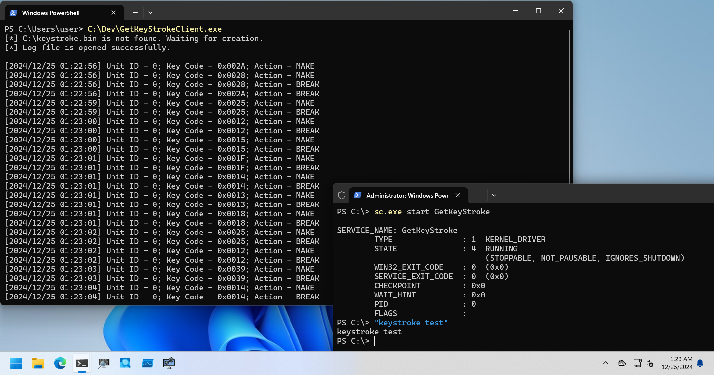

# GetKeyStroke

PoCs to log keyboard action with kernel driver.

## Installation

```
PS C:\> sc.exe create GetKeyStroke type= kernel binpath= C:\Dev\GetKeyStrokeDrv_x64.sys
PS C:\> sc.exe start GetKeyStroke
```

## Client Program Usage

`GetKeyStrokeDrv.sys` stores logged keyboard actions to `C:\keystroke.bin`, and client program read and parse it.
If `C:\keystroke.bin` was not found, this client program wait for log file creation by the kernel driver.
Simply execute as follows:

```
PS C:\Dev> .\GetKeyStrokeClient.exe
[*] C:\keystroke.bin is not found. Waiting for creation.
[*] Log file is opened successfully.

[2024/12/25 01:22:56] Unit ID - 0; Key Code - 0x002A; Action - MAKE
[2024/12/25 01:22:56] Unit ID - 0; Key Code - 0x0028; Action - MAKE
[2024/12/25 01:22:56] Unit ID - 0; Key Code - 0x0028; Action - BREAK
[2024/12/25 01:22:56] Unit ID - 0; Key Code - 0x002A; Action - BREAK
[2024/12/25 01:22:59] Unit ID - 0; Key Code - 0x0025; Action - MAKE
[2024/12/25 01:22:59] Unit ID - 0; Key Code - 0x0025; Action - BREAK

--snip--
```

