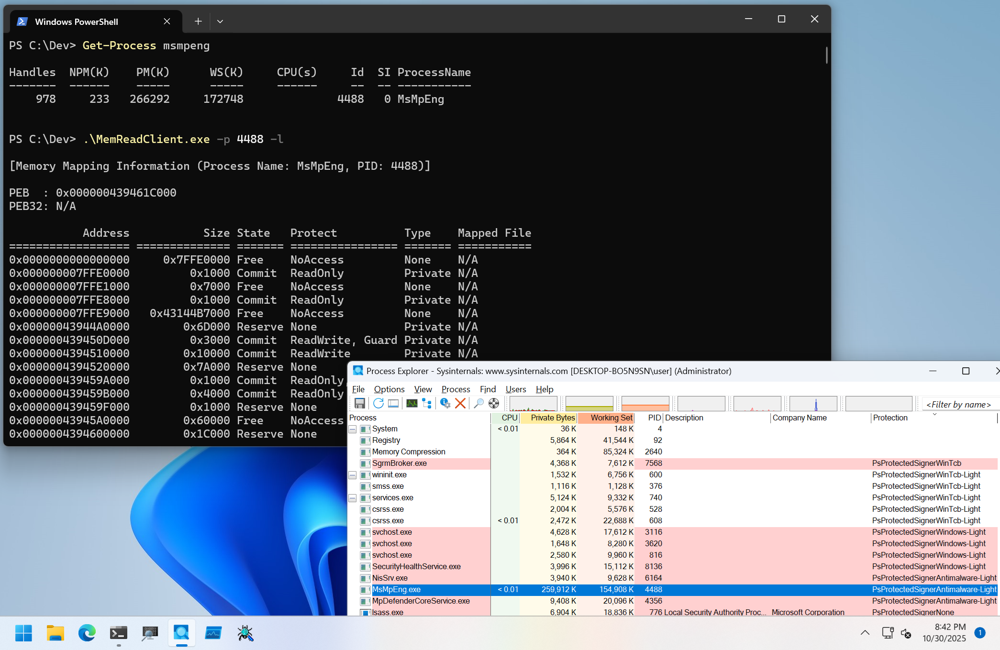
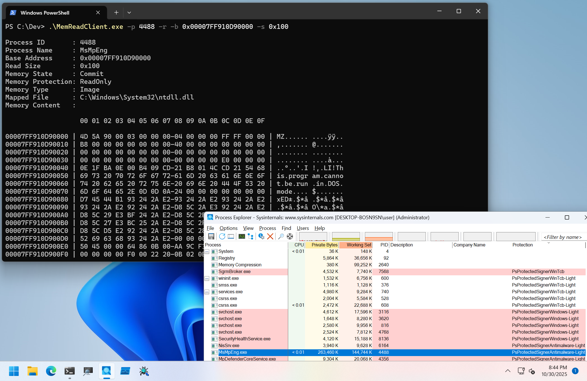

# MemRead

PoCs to read arbitrary process memory.

## Installation
```
PS C:\> sc.exe create MemRead type= filesys binpath= C:\Dev\MemReadDrv_x64.sys
PS C:\> sc.exe start MemRead
```

## Client Program Usage

Client program reads and queries process memory.

```
PS C:\Dev> .\MemReadClient.exe -h

MemReadClient - Client for MemReadDrv.

Usage: MemReadClient.exe [Options]

        -h, --help : Displays this help message.
        -l, --list : Flag to list memory mapping information.
        -r, --read : Flag to read memory content.
        -p, --pid  : Specifies a target PID.
        -b, --base : Specifies base address to read. Use with -r flag.
        -s, --size : Specifies size to read. Use with -r flag.
```

To query memory mapping information, set `-l` flag and specify a target PID with `-p` option as follows:

```
PS C:\Dev> Get-Process msmpeng

Handles  NPM(K)    PM(K)      WS(K)     CPU(s)     Id  SI ProcessName
-------  ------    -----      -----     ------     --  -- -----------
    978     233   266292     172748              4488   0 MsMpEng


PS C:\Dev> .\MemReadClient.exe -p 4488 -l

[Memory Mapping Information (Process Name: MsMpEng, PID: 4488)]

PEB  : 0x000000439461C000
PEB32: N/A

           Address           Size State   Protect          Type    Mapped File
================== ============== ======= ================ ======= ===========
0x0000000000000000     0x7FFE0000 Free    NoAccess         None    N/A
0x000000007FFE0000         0x1000 Commit  ReadOnly         Private N/A
0x000000007FFE1000         0x7000 Free    NoAccess         None    N/A
0x000000007FFE8000         0x1000 Commit  ReadOnly         Private N/A
0x000000007FFE9000   0x43144B7000 Free    NoAccess         None    N/A
0x00000043944A0000        0x6D000 Reserve None             Private N/A

--snip--

0x00007FF910F0F000         0x2000 Commit  WriteCopy        Image   C:\Windows\System32\ntdll.dll
0x00007FF910F11000         0x9000 Commit  ReadWrite        Image   C:\Windows\System32\ntdll.dll
0x00007FF910F1A000        0x8A000 Commit  ReadOnly         Image   C:\Windows\System32\ntdll.dll
0x00007FF910FA4000    0x6EF04C000 Free    NoAccess         None    N/A
```

To read process memory, set `-r` flag and specify a target PID with `-p` option.
Base address and size to read can be specify with `-b` option and `-s` option as follows:

```
PS C:\Dev> .\MemReadClient.exe -p 4488 -r -b 0x00007FF910D90000 -s 0x80

Process ID       : 4488
Process Name     : MsMpEng
Base Address     : 0x00007FF910D90000
Read Size        : 0x80
Memory State     : Commit
Memory Protection: ReadOnly
Memory Type      : Image
Mapped File      : C:\Windows\System32\ntdll.dll
Memory Content   :

                   00 01 02 03 04 05 06 07 08 09 0A 0B 0C 0D 0E 0F

00007FF910D90000 | 4D 5A 90 00 03 00 00 00-04 00 00 00 FF FF 00 00 | MZ...... ....ÿÿ..
00007FF910D90010 | B8 00 00 00 00 00 00 00-40 00 00 00 00 00 00 00 | ,....... @.......
00007FF910D90020 | 00 00 00 00 00 00 00 00-00 00 00 00 00 00 00 00 | ........ ........
00007FF910D90030 | 00 00 00 00 00 00 00 00-00 00 00 00 E0 00 00 00 | ........ ....à...
00007FF910D90040 | 0E 1F BA 0E 00 B4 09 CD-21 B8 01 4C CD 21 54 68 | ..º..'.I !,.LI!Th
00007FF910D90050 | 69 73 20 70 72 6F 67 72-61 6D 20 63 61 6E 6E 6F | is.progr am.canno
00007FF910D90060 | 74 20 62 65 20 72 75 6E-20 69 6E 20 44 4F 53 20 | t.be.run .in.DOS.
00007FF910D90070 | 6D 6F 64 65 2E 0D 0D 0A-24 00 00 00 00 00 00 00 | mode.... $.......
```




