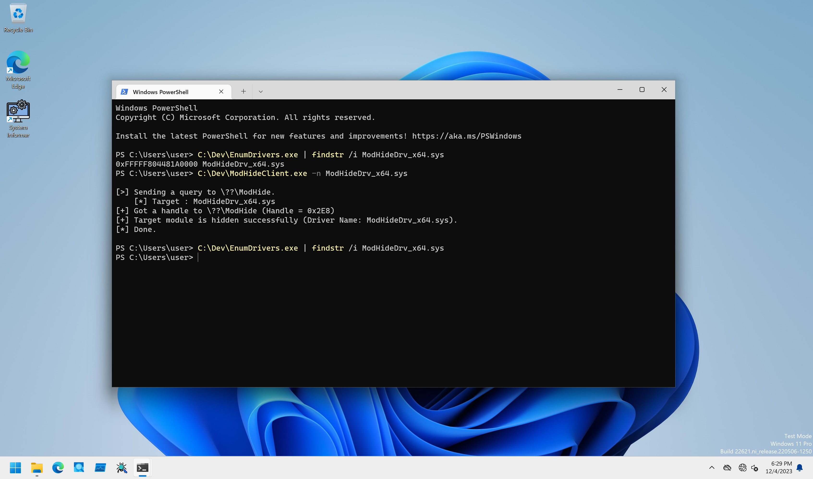

# ModHide

PoCs to hide loaded kernel drivers with DKOM method.

## Installation

```
PS C:\> sc.exe create ModHide type= kernel binpath= C:\Dev\ModHideDrv_x64.sys
PS C:\> sc.exe start ModHide
```

## Client Program Usage

Client program tries to hide loaded kernel driver from `NtQuerySystemInformation` API.

```
PS C:\Dev> .\ModHideClient.exe -h

ModHideClient - Client for ModHideDrv.

Usage: ModHideClient.exe [Options]

        -h, --help : Displays this help message.
        -n, --name : Specifies a complete file name of kernel driver to hide from NtQuerySystemInformation() API.

[!] -n option is required.
```

To test this module, use [EnumDrivers](./EnumDrivers/) in this project or [QueryModule](../QueryModule/) PoC.
EnumDrivers only enumerate loaded kernel drivers with `NtQuerySystemInformation` API as follows:

```
PS C:\Dev> .\EnumDrivers.exe

[>] Trying to enumerate kernel drivers.
[+] Got 189 modules.

Address            Module Name
================== ===========
0xFFFFF80422A00000 ntoskrnl.exe
0xFFFFF804224D0000 hal.dll
0xFFFFF80422580000 kdnet.dll
0xFFFFF80422520000 kd_02_8086.dll
0xFFFFF80422140000 mcupdate_GenuineIntel.dll
0xFFFFF80427E90000 CLFS.SYS
0xFFFFF804225D0000 tm.sys
0xFFFFF80427F00000 PSHED.dll
0xFFFFF80427F20000 BOOTVID.dll
0xFFFFF80428050000 FLTMGR.SYS
0xFFFFF80428100000 msrpc.sys

--snip--
```

To test kernel driver entry hiding, specify the target kernel driver's image file name including extension with `-n` option as follows:

```
PS C:\Dev> .\EnumDrivers.exe | findstr /i ModHideDrv_x64.sys
0xFFFFF804481D0000 ModHideDrv_x64.sys
PS C:\Dev> .\ModHideClient.exe -n ModHideDrv_x64.sys

[>] Sending a query to \??\ModHide.
    [*] Target : ModHideDrv_x64.sys
[+] Got a handle to \??\ModHide (Handle = 0x2CC)
[+] Target module is hidden successfully (Driver Name: ModHideDrv_x64.sys).
[*] Done.

PS C:\Dev> .\EnumDrivers.exe | findstr /i ModHideDrv_x64.sys
PS C:\Dev>
```

