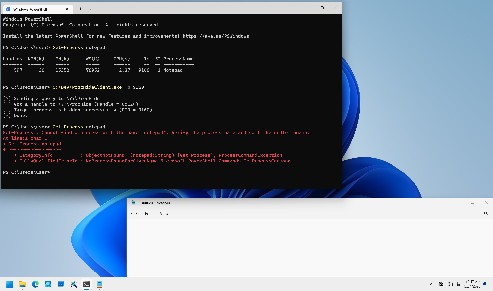

# ProcHide

PoCs to hide process with DKOM method.

## Installation

```
PS C:\> sc.exe create ProcHide type= kernel binpath= C:\Dev\ProcHideDrv_x64.sys
PS C:\> sc.exe start ProcHide
```

## Client Program Usage

Client program tries to hide a process specified with PID.

```
PS C:\Dev> .\ProcHideClient.exe -h

ProcHideClient - Client for ProcHideDrv.

Usage: ProcHideClient.exe [Options]

        -h, --help : Displays this help message.
        -p, --pid  : Specifies a target PID in decimal format.

[!] -p option is required.
```

To test this module, set your target PID with `-p` as follows:

```
PS C:\Dev> Get-Process notepad

Handles  NPM(K)    PM(K)      WS(K)     CPU(s)     Id  SI ProcessName
-------  ------    -----      -----     ------     --  -- -----------
    575      29    14880      76248       0.64   3236   1 Notepad


PS C:\Dev> .\ProcHideClient.exe -p 3236

[>] Sending a query to \??\ProcHide.
[+] Got a handle to \??\ProcHide (Handle = 0x104)
[+] Target process is hidden successfully (PID = 3236).
[*] Done.

PS C:\Dev> Get-Process notepad
Get-Process : Cannot find a process with the name "notepad". Verify the process name and call the cmdlet again.
At line:1 char:1
+ Get-Process notepad
+ ~~~~~~~~~~~~~~~~~~~
    + CategoryInfo          : ObjectNotFound: (notepad:String) [Get-Process], ProcessCommandException
    + FullyQualifiedErrorId : NoProcessFoundForGivenName,Microsoft.PowerShell.Commands.GetProcessCommand
```

