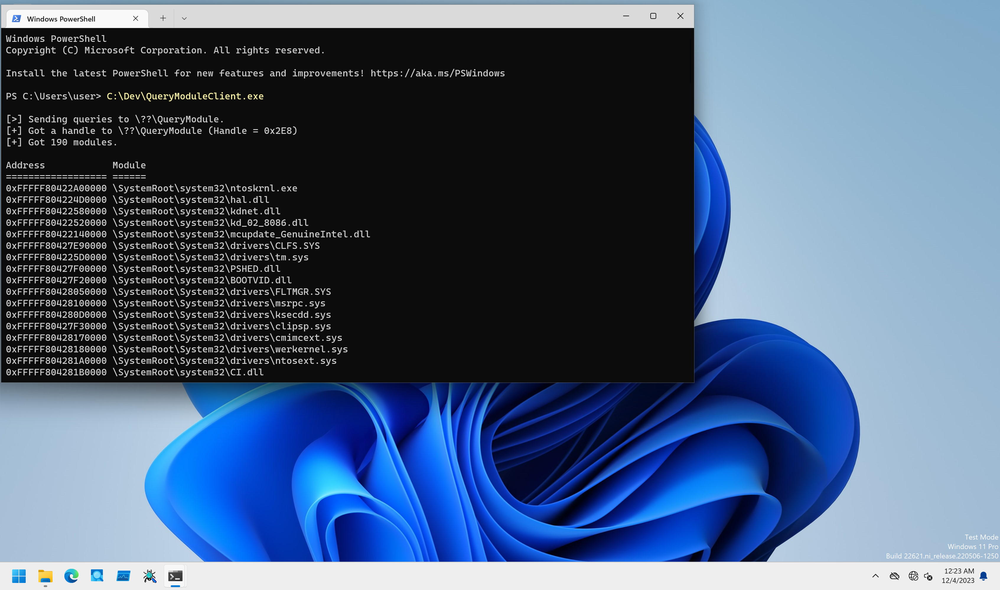

# QueryModule

PoCs to perform retrieving kernel driver loaded address information.

## Installation

```
PS C:\> sc.exe create QueryModule type= kernel binpath= C:\Dev\QueryModuleDrv_x64.sys
PS C:\> sc.exe start QueryModule
```

## Client Program Usage

Client only tries to get kernel driver loaded address information.

```
PS C:\Dev> .\QueryModuleClient.exe

[>] Sending queries to \??\QueryModule.
[+] Got a handle to \??\QueryModule (Handle = 0x2AC)
[+] Got 190 modules.

Address            Module
================== ======
0xFFFFF80422A00000 \SystemRoot\system32\ntoskrnl.exe
0xFFFFF804224D0000 \SystemRoot\system32\hal.dll
0xFFFFF80422580000 \SystemRoot\system32\kdnet.dll
0xFFFFF80422520000 \SystemRoot\system32\kd_02_8086.dll
0xFFFFF80422140000 \SystemRoot\system32\mcupdate_GenuineIntel.dll
0xFFFFF80427E90000 \SystemRoot\System32\drivers\CLFS.SYS
0xFFFFF804225D0000 \SystemRoot\System32\drivers\tm.sys
0xFFFFF80427F00000 \SystemRoot\system32\PSHED.dll
0xFFFFF80427F20000 \SystemRoot\system32\BOOTVID.dll
0xFFFFF80428050000 \SystemRoot\System32\drivers\FLTMGR.SYS
0xFFFFF80428100000 \SystemRoot\System32\drivers\msrpc.sys
0xFFFFF804280D0000 \SystemRoot\System32\drivers\ksecdd.sys
0xFFFFF80427F30000 \SystemRoot\System32\drivers\clipsp.sys

--snip--
```

